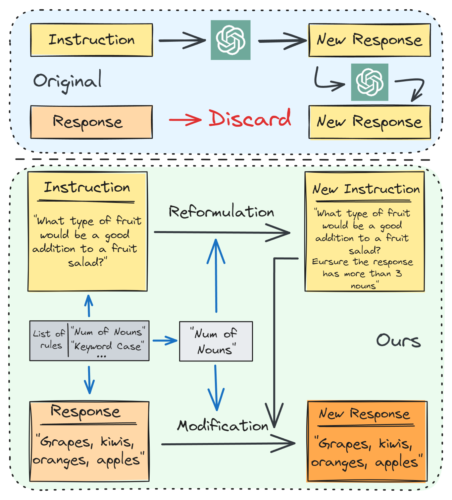

# RuleR: Improving LLM Controllability by Rule-based Data Recycling

[RuleR: Improving LLM Controllability by Rule-based Data Recycling](https://arxiv.org/abs/2406.15938) (NAACL'25)

This is the repo for the RuleR project, which proposes **a data augmentation method incorporating multiple constraints into the original data samples according to predefined rules, without any human/LLM editing on responses.** 

(Feel free to email minglii@umd.edu for any questions or feedback.)

## News
- [2025/01] Our paper has been accepted to the **NAACL 2025** main conference! 
- [2024/06] We initialized the RuleR repo.

## Contents
- [Overview](#overview)
- [Highlights](#highlights)
- [Install](#install)
- [Run Code](#run-code)
- [ToDo](#todo)
- [Citation](#citation)
- [Our Related Works](#our-related-works)

## Overview

Large language models (LLMs) still lack delicate controllability over their responses, which is critical to enhancing their performance and the user experience. 
However, curating supervised fine-tuning (SFT) datasets to improve LLM controllability usually relies on human experts or proprietary LLMs, which requires additional costs. 
To bridge this gap, we propose Rule-based Data Recycling (RuleR), a data augmentation method incorporating multiple constraints into the original data samples according to predefined rules, which creates new training tasks to consolidate the controllability of LLMs. 
Instead of creating new data from scratch, RuleR ``recycles'' existing data by simply applying rule-based edits to their responses and appending the rule-instructions in their original instructions. 
Experimental results demonstrate RuleR's effectiveness in improving LLM controllability while maintaining general instruction-following capabilities.

<p align="center" width="50%">
<a ></a>
</p>

Comparing existing methods (top) and our RuleR (bottom) for enhancing LLM controllability. Most existing methods rely on extra-human/model supervision to generate or edit instructions and responses, neglecting the remaining potential of the original data. On the contrary, RuleR demonstrates that simple rule-based (human/model-free) editing of existing data can greatly improve LLM controllability.

## Highlights

* RuleR is the first **human/model-free data augmentation approach designed to improve LLM controllability** in enforcing multiple constraints to LLM-generated response.

## Install

1. Install the dependencies
```bash
pip install -r requirements.txt
```
Note: The use of RuleR only uses ```spacy``` and ```tqdm``` packages. We recommend you manually install these 2 packages and do not need to install them from requirements.txt

2. Install the Spacy model
```bash
python -m spacy download en_core_web_sm
```

## Run Code

### Single-Round Data (Alpaca format)
```bash
python rules/augment_round_single.py \
    --data_path xxx.json \ # Alpaca format needed here
    --save_path xxx_augmented.json \
    --augment_rate 0.9 \
    --epo_num 2 \
    --concate_layer 3
```

### Multi-Round Data (ShareGPT format)
```bash
python rules/augment_round_multi.py \
    --data_path xxx.json \  # ShareGPT format needed here
    --save_path xxx_augmented.json \ 
    --augment_rate 0.9 \
    --epo_num 2 \
    --concate_layer 3
```

```--data_path```: Input data path. <br>
```--save_path```: Save data path. <br>
```--augment_rate```: The probability of implmenting augmentation. <br>
```--epo_num```: The times of random augmentation process to be run. <br>
```--concate_layer```: The max rule number for each sample. <br>

## Training

We use the prompt and code base from [FastChat](https://github.com/lm-sys/FastChat):

```
A chat between a curious user and an artificial intelligence assistant. The assistant gives helpful, detailed, and polite answers to the user's questions. USER: Hi ASSISTANT: Hello.</s>USER: Who are you? ASSISTANT: I am ...</s>......
```

## ToDo
- [x] Initialize the repo.
- [x] Release paper on Arxiv.

## Citation

Please consider citing our papers if you think our codes, data, or models are useful. Thank you! <br>

```
@misc{li2024rulerimprovingllmcontrollability,
      title={RuleR: Improving LLM Controllability by Rule-based Data Recycling}, 
      author={Ming Li and Han Chen and Chenguang Wang and Dang Nguyen and Dianqi Li and Tianyi Zhou},
      year={2024},
      eprint={2406.15938},
      archivePrefix={arXiv},
      primaryClass={cs.CL},
      url={https://arxiv.org/abs/2406.15938}, 
}

@misc{li2024mosaicitenhancinginstruction,
      title={Mosaic IT: Enhancing Instruction Tuning with Data Mosaics}, 
      author={Ming Li and Pei Chen and Chenguang Wang and Hongyu Zhao and Yijun Liang and Yupeng Hou and Fuxiao Liu and Tianyi Zhou},
      year={2024},
      eprint={2405.13326},
      archivePrefix={arXiv},
      primaryClass={cs.CL},
      url={https://arxiv.org/abs/2405.13326}, 
}
```

## Our Related Works

If you are interested in **Data Selection** for Instruction Tuning, please see [Cherry_LLM](https://github.com/MingLiiii/Cherry_LLM) and [Superfiltering](https://github.com/tianyi-lab/Superfiltering). <br>
If you are interested in **human/LLM-free Data Augmentation** for Instruction Tuning, please see [Mosaic-IT](https://github.com/tianyi-lab/Mosaic-IT) and [RuleR](https://github.com/MingLiiii/RuleR). <br>
If you are interested in **Data Improvement** for Instruction Tuning, please see [Reflection_Tuning](https://github.com/tianyi-lab/Reflection_Tuning). <br>
If you are interested in **Knowledge Distillation** in the LLM era, please see this [Survey](https://github.com/Tebmer/Awesome-Knowledge-Distillation-of-LLMs). <br>


